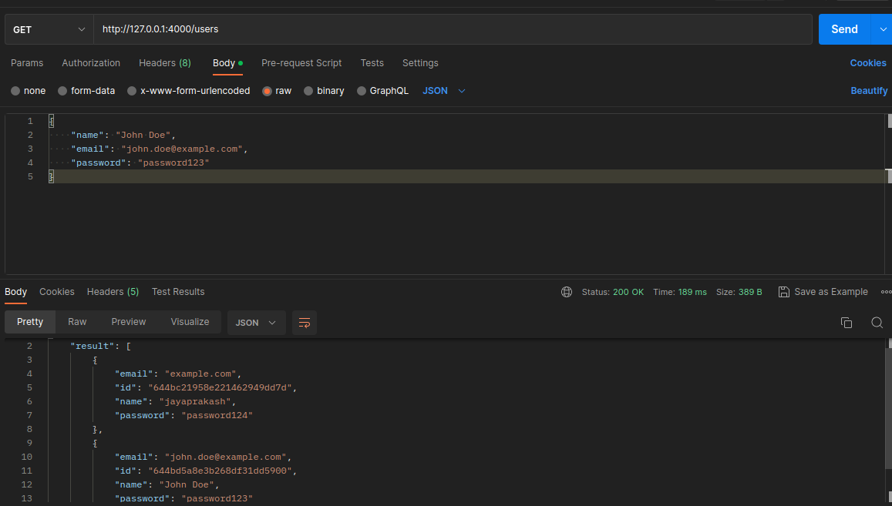
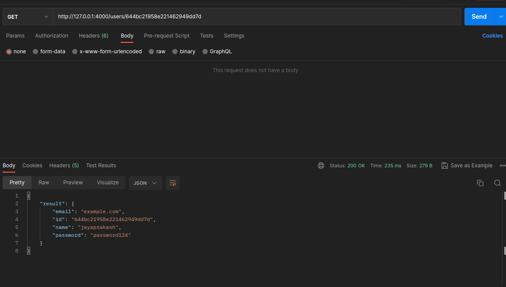
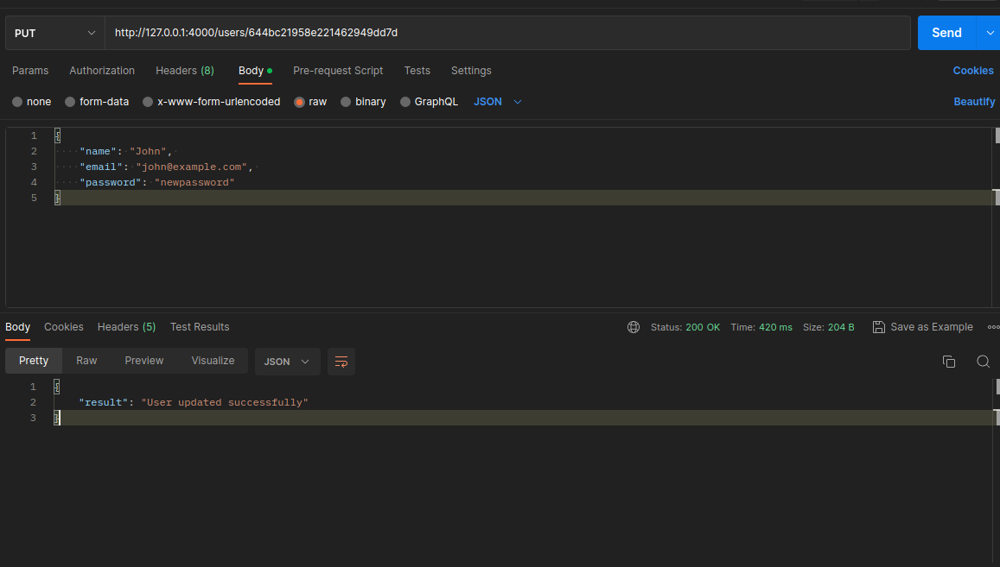
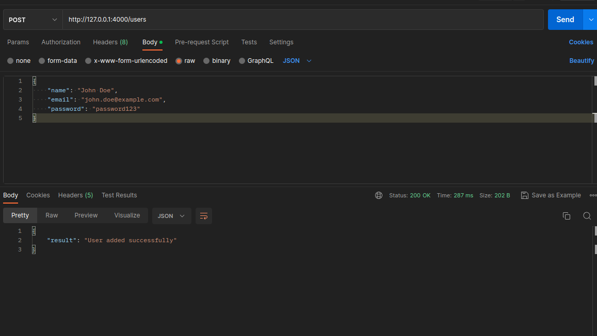
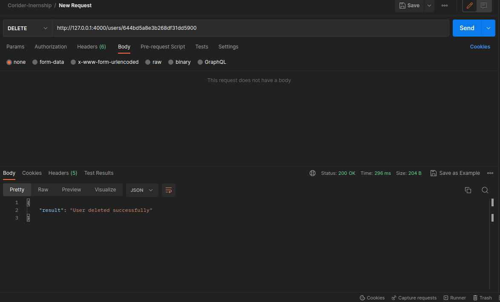

## app.py

### Import Necessary Libraries:

```python
from flask import Flask, jsonify, request
from flask_pymongo import PyMongo
from bson import ObjectId
import os
from dotenv import load_dotenv
load_dotenv()
```

### Initialize Flask app and Create new instance of MongoDB Client:

```python
app = Flask(__name__)
app.config["MONGO_URI"] = os.getenv('MONGO_URI')
app.config["MONGO_DBNAME"] = "mydatabase"
mongo = PyMongo(app)
db = mongo.db
```

### Necessary routes and Functions of the REST API

```python
@app.route('/',methods=['GET'])
def home():
    return jsonify({'message': 'Welcome to my API'})

# GET all users
@app.route('/users', methods=['GET'])
def get_all_users():
    users = db.users.find()
    output = []
    for user in users:
        output.append({'id': str(user['_id']), 'name': user['name'], 'email': user['email'], 'password': user['password']})
    return jsonify({'result': output})

# GET user by id
@app.route('/users/<id>', methods=['GET'])
def get_user_by_id(id):
    user = db.users.find_one({'_id': ObjectId(id)})
    if user:
        output = {'id': str(user['_id']), 'name': user['name'], 'email': user['email'], 'password': user['password']}
    else:
        output = 'User not found'
    return jsonify({'result': output})

#test
@app.route('/test-db', methods=['GET'])
def test_db():
    try:
        db.collection_names()
        return jsonify({'message': 'Successfully connected to MongoDB'})
    except Exception as e:
        return jsonify({'message': 'Could not connect to MongoDB', 'error': str(e)})

# POST a new user
@app.route('/users', methods=['POST'])
def add_user():
    user = {'name': request.json['name'], 'email': request.json['email'], 'password': request.json['password']}
    db.users.insert_one(user)
    return jsonify({'result': 'User added successfully'})

# PUT (update) user by id
@app.route('/users/<id>', methods=['PUT'])
def update_user(id):
    user = db.users.find_one({'_id': ObjectId(id)})
    if user:
        db.users.update_one({'_id': ObjectId(id)}, {'$set': {'name': request.json['name'], 'email': request.json['email'], 'password': request.json['password']}})
        output = 'User updated successfully'
    else:
        output = 'User not found'
    return jsonify({'result': output})

# DELETE user by id
@app.route('/users/<id>', methods=['DELETE'])
def delete_user(id):
    user = db.users.find_one({'_id': ObjectId(id)})
    if user:
        db.users.delete_one({'_id': ObjectId(id)})
        output = 'User deleted successfully'
    else:
        output = 'User not found'
    return jsonify({'result': output})
```

The above code contains an API for a user management system. It includes endpoints for creating, retrieving, updating, and deleting user data from a MongoDB database. The API includes endpoints for getting all users, getting a user by ID, adding a new user, updating an existing user, and deleting a user by ID. There is also an endpoint for testing the database connection.

### Run the Flask App:
```
if __name__ == '__main__':
    app.run(debug=True)
```

## Procedure to Run this Flask App:

### Step 1:

Install all the necessary libraries such as Flask, Pymongo, bson and dotenv by simply using the requirements.txt file as given in the below command

```python
pip install -r requirements.txt
```

Another option would be manually installing these dependencies as per your supported versions.

### Step 2:

Once the installation of the dependencies are completed , you can then start the flask server by running the [app.py](http://app.py) file 

```python
python3 -m flask run 
```

This will start the server in port 5000 by default

## Testing:

I have made use of postman to test out all the API endpoints and was sucessfully able to Create,Read,Update and Delete from the MongoDB database I created using MongoDB Atlas.

### Read User:

1. Open Postman and create a new request of type GET.
2. Enter the URL for the endpoint you want to test, e.g. **`http://localhost:5000/users`**.
3. Send the request and check the response in the "Body" tab. It should return a JSON object containing all the users present in the database if the request was successful.



### Read User(by id):

1. Open Postman and create a new request.
2. In the request URL field, enter the URL for the **`get_user_by_id()`** method, for example, **`http://localhost:5000/users/615eaa4279d297425f46cbea`**.
3. Set the HTTP method to GET.
4. Click on the Send button to send the request.
5. Postman will display the response from the server in the Response section, which should contain the user details if the user is found, or a message saying "User not found" if the user is not found.



### Update User (by id):

1. Open Postman and create a new request of type PUT.
2. Enter the URL for the endpoint you want to test, e.g. **`http://localhost:5000/users/<id>`** where **`<id>`** is the ID of the user you want to update.
3. In the request body, select the "raw" format and choose "JSON" from the dropdown menu.
4. Enter the JSON object containing the updated user data, e.g. **`{"name": "John", "email": "john@example.com", "password": "newpassword"}`**.
5. Send the request and check the response in the "Body" tab. It should return a JSON object containing a "result" key with the message "User updated successfully" if the update was successful, or "User not found" if the user with the given ID does not exist in the database.



### Create User:

1. Open Postman and create a new request.
2. Set the request method to POST and enter the URL of your API endpoint, which should be **`http://localhost:5000/users`**.
3. Select the "Body" tab and choose "raw" as the input format. Set the content type to "JSON (application/json)".
4. In the request body, enter the user data in JSON format. For example:
    
    ```json
    
    {
      "name": "John Smith",
      "email": "john.smith@example.com",
      "password": "password123"
    }
    
    ```
    
5. Click the "Send" button to send the request to your API endpoint.
6. The response will be displayed in the "Body" tab of the response panel. It should contain a JSON object with a "result" field that says "User added successfully".



### Delete User( by id):

To evaluate the **`delete_user`** method in Postman, follow these steps:

1. Open Postman and create a new request.
2. Set the request method to "DELETE".
3. Enter the URL **`http://localhost:5000/users/{id}`**, where **`{id}`** is the ID of the user you want to delete.
4. Click the "Send" button to send the request.
5. Check the response to see if the user was deleted successfully. The response will be in JSON format and will contain a message indicating whether the user was deleted or not.

